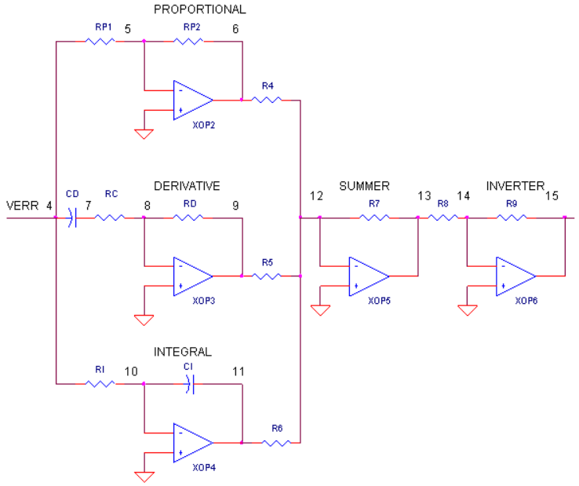
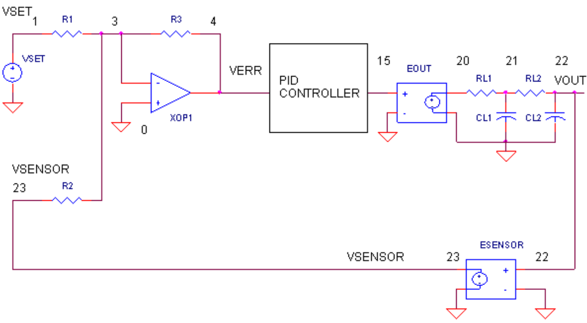
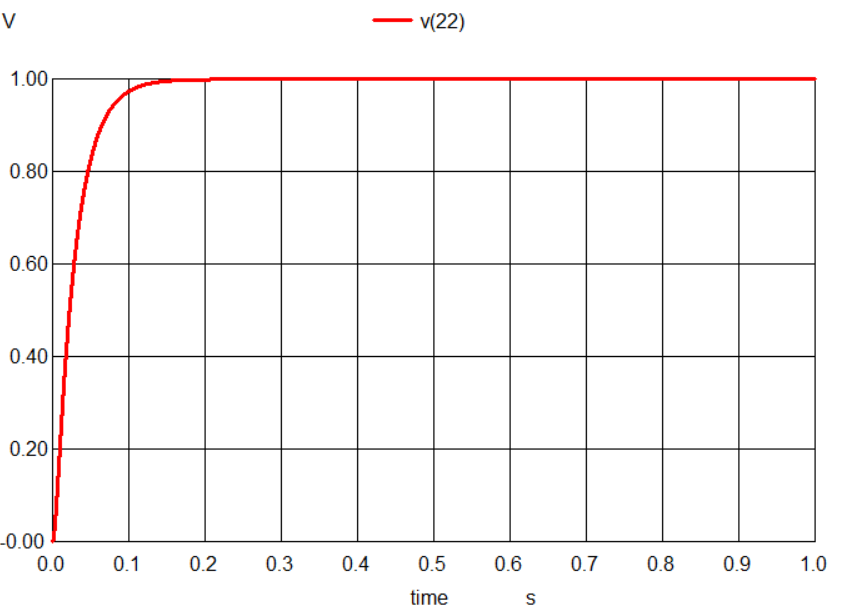

# PID Controller circuit

## Aim
To Design and simulate PID Controller circuit using Operational Amplifier in NgSpice software

## Working
Op-amp  as  inverting  amplifier  is  used to calculate  the  proportional  term,  op-amp  as  a  differentiator is  used  to  calculate  the  derivative  term.  An  op-amp  as  an integrator is used to calculate the integral term. The value of KP, KD & KI depends on the respective op-amp gain. These terms are added using an op-amp as summer, followed by an inverting op-amp to compensate for the inversion caused due to the circuit.

## Circuit Diagram

## Output

